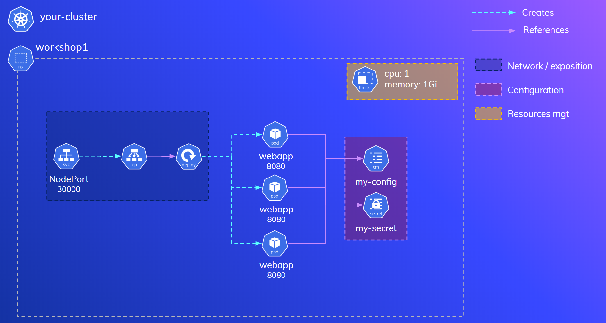

# k8s-workshop-1

In this exercise you will be putting into practice numerous concepts that will cover:

- Building a Java app in Docker and push the image to the internal Microk8s `registry`.
- Creating a `namespace`.
- Assigning a `ResourceQuota` to a `namespace`.
- Creating a `Deployment` of multiple replicas.
- Setting resource `requests` to Pods.
- Creating a `ConfigMap` and mount it into a container as an `env` variable.
Creating a `Secret` and mount it into a container as an `env` variable.
- Communicate pods from different namespaces.




## Building the app with Docker

```cli
$ git clone https://github.com/felipecruz91/k8s-workshop-1.git
$ cd k8s-workshop-1
$ docker build -t webapp .
```

## Pushing the Docker image to the internal Microk8s registry

Make sure you have the Microk8s registry running: `microk8s.enable registry`.

```cli
$ docker tag webapp localhost:32000/webapp
$ docker push localhost:32000/webapp
```

## Create the namespace

```cli
$ kubectl create ns workshop1
namespace/workshop1 created
```

## Set a resource quota in the namespace

The sum of cpu consumed per all the pods in the namespace cannot exceed `1` CPU and `1G` of memory in the `workshop1` namespace.
memory: 256Mi 

```cli
$ kubectl create quota workshop1-quota \
    --hard=cpu=1,memory=1Gi \
    --dry-run \
    -o yaml > workshop1-quota.yaml

$ kubectl apply -f workshop1-quota.yaml -n workshop1
resourcequota/workshop1-quota created

$ kubectl describe resourcequota workshop1-quota -n workshop1
Name:       workshop1-quota
Namespace:  workshop1
Resource    Used  Hard
--------    ----  ----
cpu         0     1
memory      0     1Gi
```

## Create a 3-replica deployment

```cli
$ kubectl run webapp-deployment \
    --image=localhost:32000/webapp \
    --restart=Always \
    --replicas=3 \
    --port=8080 \
    --requests=cpu=100m,memory=200Mi \
    --dry-run \
    -o yaml > webapp-deployment.yaml
```
Create the deployment in the `workshop1` namespace.

```cli
$ kubectl apply -f webapp-deployment.yaml -n workshop1
deployment.apps/webapp-deployment created

$ kubectl get deployment -n workshop1
NAME                READY   UP-TO-DATE   AVAILABLE   AGE
webapp-deployment   3/3     3            3           17s

$ kubectl describe resourcequota workshop1-quota -n workshop1
Name:       workshop1-quota
Namespace:  workshop1
Resource    Used   Hard
--------    ----   ----
cpu         300m   1
memory      600Mi  1Gi
```

## Create a NodePort service

```cli
$ kubectl create service nodeport webapp-svc \
--node-port=30000 \
--tcp=8080:8080 \
--dry-run \
-o yaml > webapp-svc.yaml
```
Update the NodePort service `selector` to route traffic to the pods of the `webapp-deployment`:

```yaml
selector:
  run: webapp-deployment
```

Create the service in the `workshop1` namespace:

```cli
$ kubectl apply -f webapp-svc.yaml -n workshop1
service/webapp-svc created

$ kubectl get svc -n workshop1
NAME         TYPE       CLUSTER-IP     EXTERNAL-IP   PORT(S)          AGE
webapp-svc   NodePort   10.100.77.86   <none>        8080:30000/TCP   12s
```

Verify you can reach the pods through the NodePort service:

```cli
$ curl localhost:30000
Handling request from pod webapp-deployment-587b97bd-8j9x7. DB_USERNAME: null DB_PASSWORD: null
```

## Create a ConfigMap

Create a ConfigMap named `db-configmap` that takes the `DB_USERNAME` key and value `John`. Mount it as an environment variable in the container.

```cli
$ kubectl create configmap db-configmap \
    --from-literal=DB_USERNAME=John \
    --dry-run \
    -o yaml > db-configmap.yaml
```

Create the ConfigMap in the `workshop1` namespace:

```cli
$ kubectl apply -f db-configmap.yaml -n workshop1
```

Update the `webapp-deployment.yaml` file to mount the ConfigMap `db-configmap` as an environment variable in the container:

```yaml
envFrom:
- configMapRef:
    name: db-configmap
```

Update the deployment:

```cli
$ kubectl apply -f webapp-deployment.yaml -n workshop1
deployment.apps/webapp-deployment configured
Verify it has been mounted correctly:
```cli

$ kubectl get pods -n workshop1
NAME                                 READY   STATUS    RESTARTS   AGE
webapp-deployment-7cc9c4d8fb-vbts8   1/1     Running   0          2m48s
webapp-deployment-7cc9c4d8fb-zffbx   1/1     Running   0          2m44s
webapp-deployment-7cc9c4d8fb-zqvkx   1/1     Running   0          2m47s

$ curl localhost:30000
Handling request from pod webapp-deployment-7cc9c4d8fb-zffbx. DB_USERNAME: John DB_PASSWORD: null
```

## Create a Secret

Create a secret `db-password-secret` that stores securely the database password `777`. Mount it as an environment variable with name `DB_PASSWORD` in the container.

```cli
$ kubectl create secret generic db-password-secret \
    --from-literal=DB_PASSWORD=777 \
    --dry-run \
    -o yaml > db-password-secret.yaml
```

Create the secret in the `workshop1` namespace:

```cli
$ kubectl apply -f db-password-secret.yaml -n workshop1
secret/db-password-secret created
```

Update the `webapp-deployment.yaml` file to mount the Secret `db-password-secret` as an environment variable in the container. You can do it by adding the `secretRef` to the existing `envFrom` section.

```yaml
envFrom:
    - configMapRef:
        name: db-configmap
    - secretRef:
        name: db-password-secret
```

Update the existing deployment in the `workshop1` namespace.

```cli
$ kubectl apply -f webapp-deployment.yaml -n workshop1
```

Verify the secret has been mounted successfully:

```cli
$ curl localhost:30000
Handling request from pod webapp-deployment-59f5cdbfcc-5ltnw. DB_USERNAME: John DB_PASSWORD: 777
```
## Run a temp pod in the `default` namespace

Run a temp pod in the `default` namespace that reaches the pods of the deployment that live in the `workshop1` namespace internally through the service.

```cli
$ kubectl run tmp-pod \
    --image=curlimages/curl \
    --restart=Never \
    --rm \
    -it \
    -- /bin/sh -c "while true; do curl http://webapp-svc.workshop1.svc.cluster.local:8080; sleep 1; done;"

If you don't see a command prompt, try pressing enter.
Handling request from pod webapp-deployment-59f5cdbfcc-gtprk. DB_USERNAME: John DB_PASSWORD: 777
Handling request from pod webapp-deployment-59f5cdbfcc-5ltnw. DB_USERNAME: John DB_PASSWORD: 777
Handling request from pod webapp-deployment-59f5cdbfcc-5ltnw. DB_USERNAME: John DB_PASSWORD: 777
Handling request from pod webapp-deployment-59f5cdbfcc-gtprk. DB_USERNAME: John DB_PASSWORD: 777
Handling request from pod webapp-deployment-59f5cdbfcc-5ltnw. DB_USERNAME: John DB_PASSWORD: 777
Handling request from pod webapp-deployment-59f5cdbfcc-xfbjc. DB_USERNAME: John DB_PASSWORD: 777
```

## Clean up

```cli
$ kubectl delete ns workshop1
```
